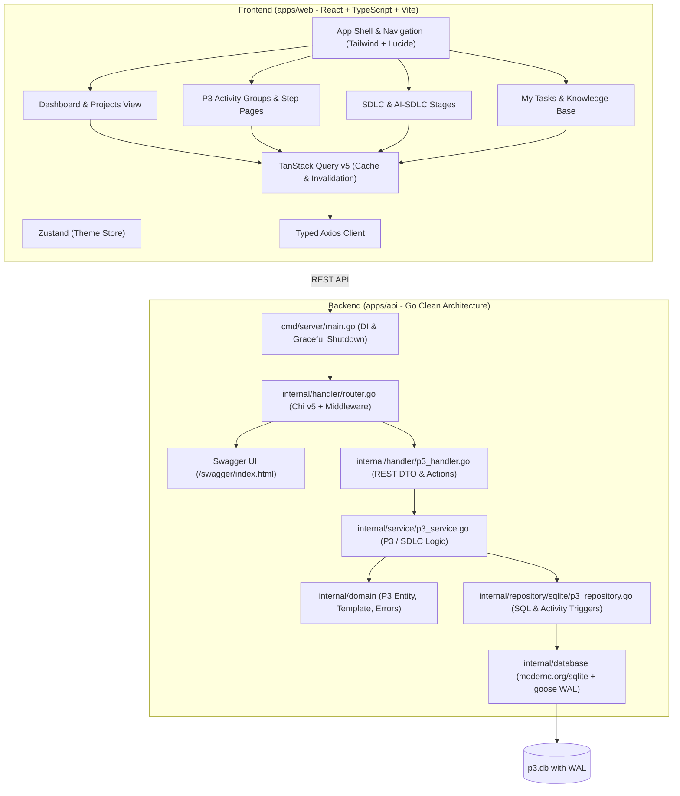

# Avari — управление проектами P3.express и SDLC / AI-SDLC

Личное веб-приложение для управления проектами по методологии **P3.express v2** со связкой со стадиями классического **SDLC** и **AI-SDLC**, задачами, чеклистами и базой знаний. Данные хранятся локально в SQLite; внешние артефакты представлены ссылками.

Запуск: установите Go, Node.js и pnpm, затем зависимости в `apps/web` (`pnpm install --frozen-lockfile`) и выполните `make dev`. Веб-интерфейс открывается на `http://localhost:4810`, API — на `http://localhost:4820`. Путь к базе задаёт `DB_PATH`; по умолчанию используется `apps/api/data/p3.db`. Для быстрой проверки демо используйте `make check-smoke`, для полной проверки с браузером — `make check-full` (после установки Playwright Chromium). `make check` сохраняет технические проверки без браузера. План работ и фактическое состояние находятся в [TASKS.md](TASKS.md).

Демо и безопасный сброс: `make demo-seed`, `make demo-api`, `make demo-reset`, `make demo-clean`. Сценарии и использование в автотестах: [docs/demo.md](docs/demo.md).

## Agent development

Repository-specific agent instructions, skills, specialist roles and executable quality gates are included.
Start with `make context`, then `make check` (Python 3.11+, Go, Node.js and pnpm; install web dependencies in `apps/web` first).
Read the [harness guide in Russian](docs/harness.md) for workflows, token tradeoffs and usage examples.
Описание страниц и макеты целевого продукта находятся в `_init/`.

[](https://github.com/OstKost/avari-p3-express/actions)
[](https://go.dev)
[](https://react.dev)
[](https://www.typescriptlang.org)
[](https://sqlite.org)
[](https://tailwindcss.com)
[](https://opensource.org/licenses/MIT)

A modern, production-grade Project Management application for **P3.express v2**, **SDLC**, and **AI-SDLC** workflows, built as a clean **Monorepo** following **Clean Architecture (Onion/Hexagonal)** principles.

---

## 🏛️ System Architecture



---

## 🌟 Key Highlights & Design Decisions

### 1. Backend (Go)
- **Clean Architecture**: Domain isolation (`internal/domain`) has zero external dependencies. Business rules reside in `internal/service`, data persistence in `internal/repository/sqlite`, and HTTP layer in `internal/handler`.
- **P3.express v2 Canonical Engine**: Automatic provisioning of 7 activity groups (A–G), 33 standard steps, checklists, and SDLC stages for each project.
- **Repeatable Cycle Management**: Preserves history and support for repeatable cycles (e.g. groups B, C, D, E).
- **Atomic Activity Logging**: SQLite database triggers record lifecycle events (`project_created`, `step_updated`, `checklist_updated`, `blocker_created`, etc.) atomically in `p3_activity`.
- **Zero-CGO SQLite (`modernc.org/sqlite`)**: 100% pure Go implementation. Compiles to static portable binaries for any target OS without C compiler toolchains.
- **SQLite Concurrency & WAL**: Configured with `PRAGMA journal_mode=WAL;`, `PRAGMA busy_timeout=5000;`, and `PRAGMA foreign_keys=ON;` for lock-free parallel reads and safe concurrent writes.
- **Embedded Database Migrations**: Uses `pressly/goose/v3` with Go standard `embed.FS` to automatically apply migrations on startup.
- **Structured Logging**: Built-in `log/slog` JSON logger with HTTP request tracing and error diagnostics.
- **Interactive OpenAPI/Swagger**: Full Swagger UI embedded and served at `/swagger/index.html`.
- **Graceful Shutdown**: Context-aware termination on `SIGINT` / `SIGTERM`.

### 2. Frontend (React + TypeScript)
- **Feature-Driven Structure**: Modular codebase separated into `app`, `features`, `entities`, and `shared`.
- **Comprehensive Project Management UI**:
  - **Dashboard**: High-level portfolio overview, active project status, urgent blockers, and quick actions.
  - **Projects List**: Filterable card/table view with RAG indicators and progress bars.
  - **Project Detail**: Tabs for Overview, P3.express Activity Matrix, and SDLC / AI-SDLC lifecycle.
  - **Step Page**: Detailed checklist management, step progress calculation, blocker logging, comments, and artifact links.
  - **My Tasks**: Action items with due dates and priority filters across projects.
  - **Knowledge Base**: P3.express & SDLC guide articles and project documentation.
- **Server State & Caching**: `@tanstack/react-query` v5 for query deduplication, background refetching, and cache invalidation.
- **Client State**: Lightweight `zustand` store for dark/light mode and workspace preferences.
- **Design System**: Tailored dark-forest and gold elven theme, accessible keyboard navigation, and responsive layout.

---

## 📂 Repository Structure

```text
avari-p3-express/
├── .github/
│   └── workflows/
│       └── ci.yml               # Automated CI (Test with race detector, lint, typecheck, build)
├── apps/
│   ├── api/                     # Go Backend
│   │   ├── cmd/
│   │   │   └── server/
│   │   │       └── main.go      # Composition Root, DI, Graceful Shutdown
│   │   ├── docs/                # Generated Swagger/OpenAPI documentation
│   │   ├── internal/
│   │   │   ├── config/          # Environment configuration (caarlos0/env)
│   │   │   ├── database/        # SQLite connection, WAL pragmas, goose migrations
│   │   │   │   └── migrations/  # Embedded SQL migrations
│   │   │   ├── domain/          # P3 Entities, Canonical Template, Custom Errors
│   │   │   ├── handler/         # Chi HTTP handlers, REST DTOs, P3 routes
│   │   │   ├── middleware/      # Slog logger, CORS, RequestID, Recovery
│   │   │   ├── repository/      # SQLite repository implementation & tests
│   │   │   └── service/         # Business logic, P3 calculations, Unit tests
│   │   ├── go.mod
│   │   ├── go.sum
│   │   ├── .golangci.yml        # Strict Go linter configuration
│   │   └── Dockerfile           # Multi-stage minimal Alpine image
│   │
│   └── web/                     # React Frontend
│       ├── src/
│       │   ├── app/             # Router, P3 App Shell, Global providers
│       │   ├── entities/        # P3 domain types, API calls, TanStack Query hooks
│       │   ├── features/        # P3 & SDLC pages (Dashboard, Projects, StepPage, Tasks, KB)
│       │   ├── shared/          # UI Kit (Button, Input, Card, Modal, Badge), hooks, Zustand store
│       │   ├── App.tsx
│       │   ├── main.tsx
│       │   └── index.css
│       ├── index.html
│       ├── package.json
│       ├── tsconfig.json
│       ├── vite.config.ts
│       ├── tailwind.config.js
│       ├── nginx.conf
│       └── Dockerfile           # Multi-stage Nginx container
│
├── deployments/
│   ├── docker-compose.yml       # Production-ready Compose with healthchecks & volumes
│   └── .env.example             # Environment template
│
├── _init/                       # Product specifications and reference designs
├── docs/                        # Architecture, ADRs, verification and harness guides
├── Makefile                     # Unified project orchestration (dev, test, lint, build, check)
├── .gitignore
├── .editorconfig
└── README.md
```

---

## 📡 REST API Reference

| Method | Endpoint | Description |
|---|---|---|
| `GET` | `/api/v1/p3/projects` | List all projects with summaries |
| `POST` | `/api/v1/p3/projects` | Create a new project with 7 activity groups |
| `GET` | `/api/v1/p3/projects/{id}` | Get full project details with phases and blockers |
| `PATCH` | `/api/v1/p3/projects/{id}` | Update project metadata (RAG status, progress, etc.) |
| `PATCH` | `/api/v1/p3/steps/{id}` | Update step status or due date |
| `POST` | `/api/v1/p3/steps/{id}/checklist` | Add a checklist item |
| `PATCH` | `/api/v1/p3/checklist/{id}` | Update checklist item (toggle done, text) |
| `DELETE` | `/api/v1/p3/checklist/{id}` | Delete a checklist item |
| `POST` | `/api/v1/p3/steps/{id}/links` | Add an artifact / documentation link |
| `DELETE` | `/api/v1/p3/links/{id}` | Delete an artifact link |
| `POST` | `/api/v1/p3/steps/{id}/comments` | Add a comment to a step |
| `POST` | `/api/v1/p3/projects/{id}/blockers` | Create a blocker for a step or SDLC stage |
| `PATCH` | `/api/v1/p3/blockers/{id}` | Update or resolve a blocker |
| `PATCH` | `/api/v1/p3/sdlc-stages/{id}` | Update SDLC / AI-SDLC stage progress |
| `GET` | `/api/v1/p3/actions` | List all actions across projects |
| `POST` | `/api/v1/p3/actions` | Create a new action |
| `PATCH` | `/api/v1/p3/actions/{id}` | Update or complete an action |
| `GET` | `/api/v1/p3/articles` | List knowledge base articles |
| `POST` | `/api/v1/p3/articles` | Create a knowledge base article |
| `POST` | `/api/v1/p3/projects/{id}/cycles/{phase_code}` | Start a new cycle for repeatable groups (B, C, D, E) |
| `GET` | `/healthz` | Health check & SQLite connectivity status |
| `GET` | `/swagger/index.html` | Interactive Swagger / OpenAPI Documentation |

---

## ⚡ Quickstart Guide

### Prerequisites
- **Go** (1.22+)
- **Node.js** (20+) & **pnpm**
- **Docker & Docker Compose** (optional, for containerized run)
- **Make**

### 1. Local Development
Run backend and frontend simultaneously with a single command:
```bash
make dev
```
- **Frontend Web**: [http://localhost:4810](http://localhost:4810)
- **Backend API**: [http://localhost:4820](http://localhost:4820)
- **Swagger UI**: [http://localhost:4820/swagger/index.html](http://localhost:4820/swagger/index.html)

### 2. Run via Docker Compose
```bash
make docker-up
```
- **Frontend Web**: [http://localhost:4800](http://localhost:4800)
- **Backend API**: [http://localhost:4820](http://localhost:4820)
- **Swagger UI**: [http://localhost:4820/swagger/index.html](http://localhost:4820/swagger/index.html)

To stop:
```bash
make docker-down
```

---

## 🧪 Testing & Quality Gates

```bash
# Run all quality gates (Harness, Go API, React Web)
make check

# Run Go checks (gofmt, go vet, race tests, CGO=0 build)
make check-api

# Run React checks (ESLint, TypeScript typecheck, Vite build)
make check-web

# Run Harness checks
make check-harness
```

---

## 📄 License
This project is licensed under the [MIT License](LICENSE).

### Производственные задачи и внешние AI-агенты

В проекте доступны разделы «Задачи» и «Результаты»: постановка, попытки, проверки исполнителя и приёмка менеджером. При первом запуске API создаёт `data/manager.key`; введите ключ на локальном экране входа. В разделе доступа агентов выдайте отдельный токен на выбранный проект. Токен менеджера агенту не передаётся.

REST-контракт, подключение stdio MCP и проверка сценария: [docs/work-api.md](docs/work-api.md). Для MCP используется официальный [Go SDK v1.8.0](https://github.com/modelcontextprotocol/go-sdk/releases/tag/v1.8.0), Go 1.25. Завершение задачи сохраняет управленческие статусы P3.express и SDLC.

Агентные процедуры, три дополнительные роли, независимый QA и локальный плагин: [docs/agent-system.md](docs/agent-system.md).
